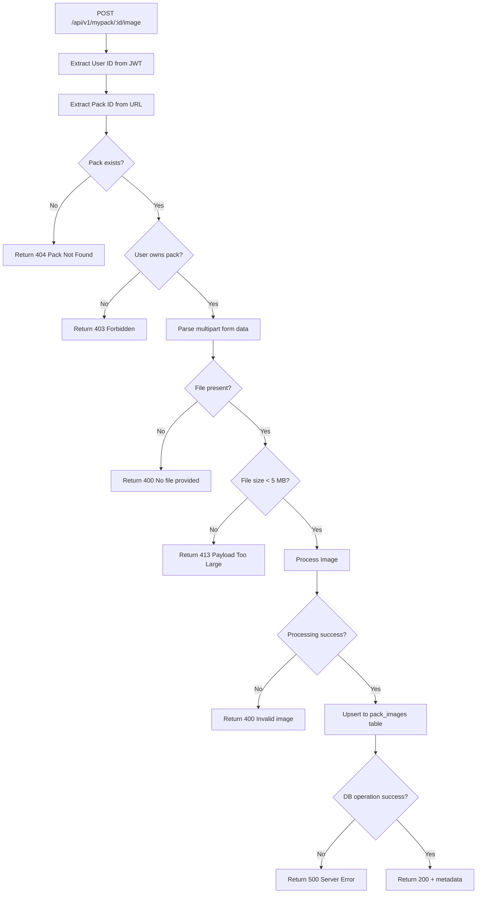
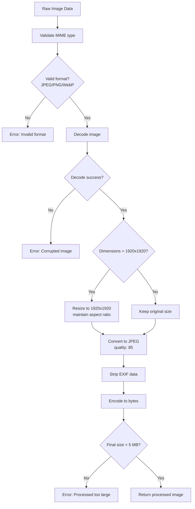
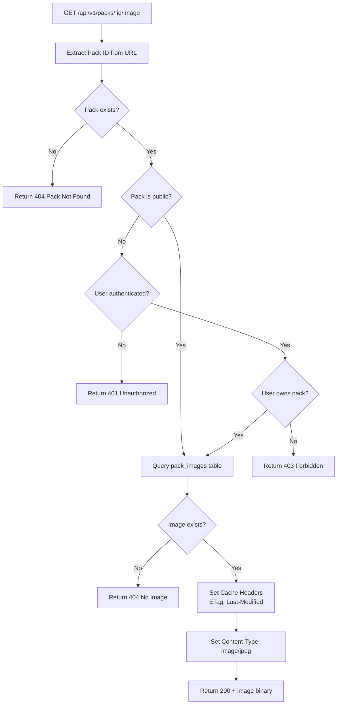
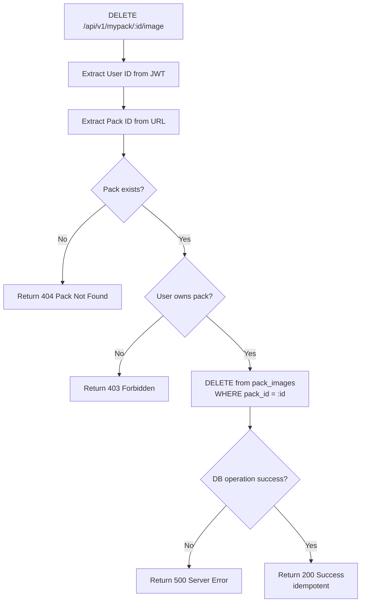

# Pack Image Upload - Specification

**Status**: Draft
**Author**: Claude Agent
**Date**: 2026-01-31

---

## 📋 Overview

### Purpose

Allow users to associate an image with their packs. This provides visual identification and improves the user experience when browsing pack collections.

### Problem

Currently, packs have no visual representation beyond their text metadata (name, description). Users cannot:

- Visually distinguish between packs at a glance
- Add a photo of their actual gear
- Personalize their pack presentation

### Goals

- Allow users to upload one image per pack
- Validate and process images (format, size, compression)
- Store images in database (for simplicity and later S3 migration)
- Provide dedicated REST endpoints for image operations
- Ensure image operations don't affect pack CRUD operations

### Non-Goals

- Multiple images per pack (future enhancement)
- Image gallery or carousel
- S3 storage (future migration, but architecture should support it)
- Client-side image processing
- Image sharing between users

---

## 🎯 Requirements

### Functional Requirements

#### FR1: Upload/Update Pack Image

**Description**: User can upload or update an image for a pack they own.

**Acceptance Criteria**:

- [ ] POST endpoint accepts multipart/form-data with image file
- [ ] User must be authenticated and own the pack
- [ ] Only one image per pack (upload replaces existing image)
- [ ] Supported formats: JPEG, PNG, WebP
- [ ] Max upload size: 5 MB
- [ ] Image is validated and processed server-side
- [ ] Returns success/error response with appropriate HTTP status

**Priority**: High

#### FR2: Retrieve Pack Image

**Description**: Anyone with pack access can retrieve the pack image.

**Acceptance Criteria**:

- [ ] GET endpoint returns raw image binary with correct Content-Type
- [ ] Supports HTTP caching headers (ETag, Last-Modified)
- [ ] Returns 404 if pack exists but has no image
- [ ] Public packs: image accessible without auth
- [ ] Private packs: image requires authentication and ownership

**Priority**: High

#### FR3: Delete Pack Image

**Description**: User can delete the image from their pack.

**Acceptance Criteria**:

- [ ] DELETE endpoint removes image from storage
- [ ] User must be authenticated and own the pack
- [ ] Returns success even if no image exists (idempotent)
- [ ] Pack metadata remains unchanged

**Priority**: High

#### FR4: Image Processing

**Description**: Uploaded images are automatically processed to optimize storage and performance.

**Acceptance Criteria**:

- [ ] Images converted to JPEG format with quality 85
- [ ] Images resized if larger than 1920x1920 (maintains aspect ratio)
- [ ] Processed image size should be < 500 KB in most cases
- [ ] Original aspect ratio preserved
- [ ] EXIF data stripped (privacy + size reduction)

**Priority**: High

#### FR5: Pack Has Image Indicator

**Description**: Pack GET endpoints indicate if a pack has an image.

**Acceptance Criteria**:

- [ ] Pack response includes `has_image: boolean` field
- [ ] Field is `true` if image exists, `false` otherwise
- [ ] Does not include image data in pack response (separate endpoint)

**Priority**: Medium

---

## 🏗️ Design

### Database Schema

#### New Table: pack_images

```sql
CREATE TABLE pack_images (
    pack_id INTEGER PRIMARY KEY REFERENCES packs(id) ON DELETE CASCADE,
    image_data BYTEA NOT NULL,
    mime_type VARCHAR(50) NOT NULL DEFAULT 'image/jpeg',
    file_size INTEGER NOT NULL,
    width INTEGER NOT NULL,
    height INTEGER NOT NULL,
    uploaded_at TIMESTAMP NOT NULL DEFAULT NOW(),
    updated_at TIMESTAMP NOT NULL DEFAULT NOW()
);
```

**Design Notes**:

- `pack_id` as PRIMARY KEY ensures one image per pack
- `ON DELETE CASCADE` ensures image is deleted when pack is deleted
- `mime_type` always 'image/jpeg' after processing
- `file_size` in bytes for monitoring and validation
- `width`/`height` for responsive display without loading full image
- Separate table keeps images out of main pack queries

#### Migration Files

**Up migration** (`000011_pack_images.up.sql`):

```sql
CREATE TABLE pack_images (
    pack_id INTEGER PRIMARY KEY REFERENCES packs(id) ON DELETE CASCADE,
    image_data BYTEA NOT NULL,
    mime_type VARCHAR(50) NOT NULL DEFAULT 'image/jpeg',
    file_size INTEGER NOT NULL,
    width INTEGER NOT NULL,
    height INTEGER NOT NULL,
    uploaded_at TIMESTAMP NOT NULL DEFAULT NOW(),
    updated_at TIMESTAMP NOT NULL DEFAULT NOW()
);

**Down migration** (`000011_pack_images.down.sql`):
```sql
DROP INDEX IF EXISTS idx_pack_images_uploaded_at;
DROP TABLE IF EXISTS pack_images;
```

### REST API Endpoints

#### POST /api/v1/mypack/{id}/image

Upload or update pack image.

**Request**:

- Method: POST
- Content-Type: multipart/form-data
- Body: form field "image" with binary file data
- Auth: Required (Bearer token)

**Response Success (200)**:

```json
{
  "message": "Image uploaded successfully",
  "pack_id": 123,
  "file_size": 245678,
  "width": 1920,
  "height": 1080,
  "mime_type": "image/jpeg"
}
```

**Response Errors**:

- 400: Invalid file format, size too large, corrupted image
- 401: Unauthorized (no token)
- 403: Forbidden (not pack owner)
- 404: Pack not found
- 413: Payload too large (> 5 MB)
- 500: Server error (processing failed)

#### GET /api/v1/packs/{id}/image

Retrieve pack image (raw binary).

**Request**:

- Method: GET
- Auth: Optional (required for private packs)

**Response Success (200)**:

- Content-Type: image/jpeg
- Body: Raw binary image data
- Headers:
  - `Cache-Control: public, max-age=86400` (24 hours)
  - `ETag: "{pack_id}-{updated_at_timestamp}"`
  - `Last-Modified: {updated_at}`

**Response Errors**:

- 401: Unauthorized (private pack, no token)
- 403: Forbidden (private pack, not owner)
- 404: Pack not found OR pack has no image
- 500: Server error

#### DELETE /api/v1/mypack/{id}/image

Delete pack image.

**Request**:

- Method: DELETE
- Auth: Required (Bearer token)

**Response Success (200)**:
```json
{
  "message": "Image deleted successfully",
  "pack_id": 123
}
```

**Response Errors**:

- 401: Unauthorized (no token)
- 403: Forbidden (not pack owner)
- 404: Pack not found
- 500: Server error

### Image Processing Pipeline

```go
// Processing steps (in order)
1. Validate MIME type (check magic bytes, not just extension)
2. Decode image (JPEG/PNG/WebP)
3. Check dimensions (if > 1920x1920, resize maintaining aspect ratio)
4. Convert to JPEG with quality 85
5. Strip EXIF data (decode without EXIF, re-encode clean)
6. Encode to bytes
7. Validate final size (< 5 MB, ideally < 500 KB)
8. Store in database
```

**Libraries to use**:

- `golang.org/x/image/draw` - Image resizing
- `image/jpeg` - JPEG encoding/decoding (standard library)
- `image/png` - PNG decoding (standard library)
- `golang.org/x/image/webp` - WebP decoding (for input files)

### Architecture for Future S3 Migration

```go
// Storage interface (allows switching implementations)
type ImageStorage interface {
    Save(ctx context.Context, packID uint, data []byte, metadata ImageMetadata) error
    Get(ctx context.Context, packID uint) (*Image, error)
    Delete(ctx context.Context, packID uint) error
    Exists(ctx context.Context, packID uint) (bool, error)
}

type ImageMetadata struct {
    MimeType  string
    FileSize  int
    Width     int
    Height    int
}

type Image struct {
    Data     []byte
    Metadata ImageMetadata
}

// v1 implementation: Database storage
type DBImageStorage struct {
    db *sql.DB
}

// Future v2 implementation: S3 storage
// type S3ImageStorage struct {
//     s3Client *s3.Client
//     bucket   string
// }
```

**Package structure**:

```markdown
pkg/images/
  ├── storage.go      // Interface definition
  ├── storage_db.go   // Database implementation
  ├── processor.go    // Image validation and processing
  ├── handlers.go     // HTTP handlers
  └── images_test.go  // Tests
```

### Business Logic Flow

#### Upload Image Flow



#### Image Processing Flow (Detail)



#### Get Image Flow



#### Delete Image Flow



---

## 🧪 Testing Strategy

### Unit Tests

#### Image Processing Tests

```go
func TestValidateImageFormat(t *testing.T)
func TestResizeImage(t *testing.T)
func TestConvertToJPEG(t *testing.T)
func TestStripEXIF(t *testing.T)
func TestProcessImage_ValidJPEG(t *testing.T)
func TestProcessImage_ValidPNG(t *testing.T)
func TestProcessImage_InvalidFormat(t *testing.T)
func TestProcessImage_TooLarge(t *testing.T)
func TestProcessImage_Corrupted(t *testing.T)
```

#### Storage Tests

```go
func TestDBStorage_Save(t *testing.T)
func TestDBStorage_Get(t *testing.T)
func TestDBStorage_Delete(t *testing.T)
func TestDBStorage_Exists(t *testing.T)
func TestDBStorage_Update(t *testing.T) // Replace existing image
func TestDBStorage_GetNonExistent(t *testing.T)
```

### Integration Tests

#### Handler Tests

```go
func TestUploadPackImage_Success(t *testing.T)
func TestUploadPackImage_Unauthorized(t *testing.T)
func TestUploadPackImage_NotOwner(t *testing.T)
func TestUploadPackImage_PackNotFound(t *testing.T)
func TestUploadPackImage_InvalidFormat(t *testing.T)
func TestUploadPackImage_TooLarge(t *testing.T)
func TestUploadPackImage_Update(t *testing.T) // Replace existing

func TestGetPackImage_Success(t *testing.T)
func TestGetPackImage_NotFound(t *testing.T)
func TestGetPackImage_CacheHeaders(t *testing.T)
func TestGetPackImage_PublicPack(t *testing.T)
func TestGetPackImage_PrivatePack_Unauthorized(t *testing.T)

func TestDeletePackImage_Success(t *testing.T)
func TestDeletePackImage_Idempotent(t *testing.T)
func TestDeletePackImage_Unauthorized(t *testing.T)
func TestDeletePackImage_NotOwner(t *testing.T)
```

### Test Data

Create sample test images:

```markdown
testdata/
  ├── valid.jpg       // Valid JPEG (2 MB)
  ├── valid.png       // Valid PNG (1 MB)
  ├── valid.webp      // Valid WebP (500 KB)
  ├── large.jpg       // Large image (3000x3000, 4 MB)
  ├── invalid.txt     // Wrong format
  ├── corrupted.jpg   // Corrupted JPEG
  └── too_large.jpg   // > 5 MB
```

---

## 📝 Implementation Plan

### Phase 1: Database Schema ✅ Completed (2026-01-31)

- [x] Create migration files (up/down)
- [x] Test migration on development database
- [x] Verify CASCADE deletion works

**Files**:

- `pkg/database/migration/migration_scripts/000011_pack_images.up.sql`
- `pkg/database/migration/migration_scripts/000011_pack_images.down.sql`

**Status**: Migration files created. Migrations are embedded using `//go:embed` and will be automatically applied when application starts. CASCADE deletion is enforced by `ON DELETE CASCADE` constraint on pack_id foreign key.

### Phase 2: Image Processing

- [ ] Create `pkg/images` package
- [ ] Implement image validation (format, size, MIME type)
- [ ] Implement resize logic (maintain aspect ratio)
- [ ] Implement JPEG conversion (quality 85)
- [ ] Implement EXIF stripping
- [ ] Write unit tests for all processing functions

**Files**:

- `pkg/images/processor.go`
- `pkg/images/processor_test.go`

### Phase 3: Storage Layer

- [ ] Define `ImageStorage` interface
- [ ] Implement `DBImageStorage`
- [ ] Write storage unit tests
- [ ] Test CRUD operations

**Files**:

- `pkg/images/storage.go`
- `pkg/images/storage_db.go`
- `pkg/images/storage_test.go`

### Phase 4: HTTP Handlers

- [ ] Implement POST `/api/v1/mypack/{id}/image` handler
- [ ] Implement GET `/api/v1/packs/{id}/image` handler
- [ ] Implement DELETE `/api/v1/mypack/{id}/image` handler
- [ ] Add ownership verification
- [ ] Add cache headers for GET
- [ ] Write handler tests

**Files**:

- `pkg/images/handlers.go`
- `pkg/images/handlers_test.go`

### Phase 5: API Integration

- [ ] Register routes in `main.go`
- [ ] Apply authentication middleware
- [ ] Update Swagger documentation
- [ ] Add `has_image` field to Pack struct
- [ ] Update pack handlers to populate `has_image`

**Files**:

- `main.go`
- `pkg/dataset/dataset.go`
- `pkg/packs/handlers.go` (for `has_image` field)

### Phase 6: Testing

- [ ] Create test images in `testdata/`
- [ ] Run all unit tests
- [ ] Run integration tests
- [ ] Test with real images (various formats/sizes)
- [ ] Verify cascade deletion
- [ ] Performance test (image processing speed)

### Phase 7: Documentation

- [ ] Update API documentation
- [ ] Add code comments
- [ ] Document processing pipeline
- [ ] Update README if needed

---

## 🔄 Alternative Approaches Considered

### Alternative 1: Store Images in Pack Table

Add `image_data BYTEA` column directly in `packs` table.

**Pros**:

- Simpler schema (one table)
- No JOIN needed

**Cons**:

- Impacts all pack queries (loads image data even when not needed)
- Poor performance for listing packs
- Difficult to add image-specific metadata

**Decision**: Rejected. Separate table provides better performance and flexibility.

### Alternative 2: Filesystem Storage

Store images as files in `/var/lib/pimpmypack/images/`.

**Pros**:

- Better performance for serving images
- Can use nginx/CDN directly
- No database size impact

**Cons**:

- Requires filesystem access and permissions
- Backup complexity (separate from DB backups)
- Orphan file risk (consistency with DB)
- Deployment complexity (persistent volume needed)

**Decision**: Rejected for v1. Database storage is simpler and good enough for initial scale.

### Alternative 3: No Image Processing

Accept any image format and store as-is.

**Pros**:

- Simpler implementation
- Faster upload (no processing)

**Cons**:

- Large storage requirements
- Slow download for users
- Inconsistent user experience (different formats/sizes)
- No optimization

**Decision**: Rejected. Processing is essential for good UX and reasonable storage.

### Alternative 4: Client-Side Processing

Process images in browser before upload.

**Pros**:

- Reduces server load
- Faster upload (smaller files)

**Cons**:

- Not all clients support it (mobile browsers)
- Security risk (can't trust client validation)
- Inconsistent results across clients
- Complex frontend code

**Decision**: Rejected. Server-side processing ensures consistency and security.

---

## 🔒 Security Considerations

### File Type Validation

- **Magic bytes check**: Verify actual file type, not just extension
- **Decode test**: Attempt to decode image to ensure it's valid
- **Reject executables**: Block files that might be scripts/executables

### Size Limits

- **Upload size**: Hard limit at 5 MB (enforced by middleware)
- **Processed size**: Validate after processing (should be < 500 KB)
- **Dimensions**: Max 1920x1920 after processing

### User Isolation

- **Ownership check**: Verify user owns pack before upload/delete
- **Private packs**: Enforce authentication for image access
- **SQL injection**: Use parameterized queries

### Privacy

- **EXIF stripping**: Remove all metadata (GPS, camera info, timestamps)

### Storage Limits

- **Per-user quota**: Consider limiting total image storage per user (future)
- **Monitoring**: Track total storage usage

---

## 📊 Impact Analysis

### Database Impact

- **Storage**: ~500 KB per pack with image (acceptable for thousands of packs)
- **Performance**: Separate table means no impact on pack queries
- **Queries**: One additional query when pack has image and it's requested

### API Impact

- **New endpoints**: 3 new endpoints (upload, get, delete)
- **Breaking changes**: None (adds fields/endpoints, doesn't modify existing)
- **Backward compatible**: Packs without images work as before

### User Experience

- **Positive**: Visual pack identification, personalization
- **Upload time**: 2-5 seconds for processing (acceptable)
- **Download time**: Fast (JPEG compression with quality 85)

---

## ✅ Acceptance Criteria Summary

- [ ] User can upload image for their pack (POST endpoint)
- [ ] User can retrieve pack image (GET endpoint)
- [ ] User can delete pack image (DELETE endpoint)
- [ ] Images are validated (format, size)
- [ ] Images are processed (JPEG conversion with quality 85, resizing, EXIF stripping)
- [ ] Only pack owner can upload/delete
- [ ] Pack response includes `has_image` boolean field
- [ ] Cascade deletion: image deleted when pack deleted
- [ ] HTTP caching headers for GET endpoint
- [ ] All tests pass
- [ ] Swagger documentation updated
- [ ] Architecture supports future S3 migration

---

## 📚 References

- Current pack model: `pkg/dataset/dataset.go`
- Pack handlers: `pkg/packs/handlers.go`
- Authentication middleware: `pkg/security/middleware.go`
- JPEG encoding: <https://pkg.go.dev/image/jpeg> (standard library)
- Image resizing: <https://pkg.go.dev/golang.org/x/image/draw>

---

## 📌 Open Questions

1. **Image dimensions for listing view**: Should we store a thumbnail (e.g., 200x200) separately for pack list views?
   - Decision: Not for v1. Client can resize. Consider for v2 if performance issue.

2. **Rate limiting**: Should we limit upload frequency per user?
   - Decision: Monitor usage first. Add if abuse detected.

3. **Content-Type for error responses**: Should GET /image return JSON error or HTTP error?
   - Decision: Return HTTP error codes only (no JSON body). Simpler for image tags.

4. **Original image preservation**: Should we keep original image as well as processed?
   - Decision: No. Only store processed JPEG. Simpler and saves storage.
